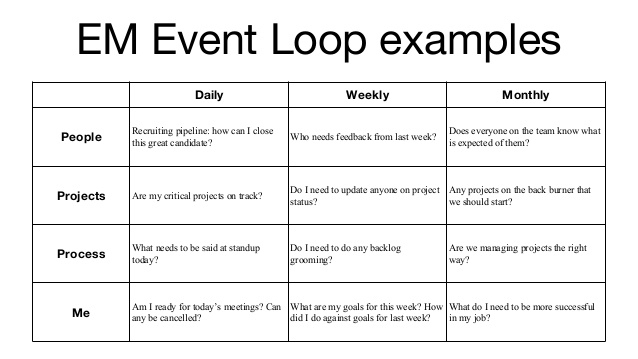
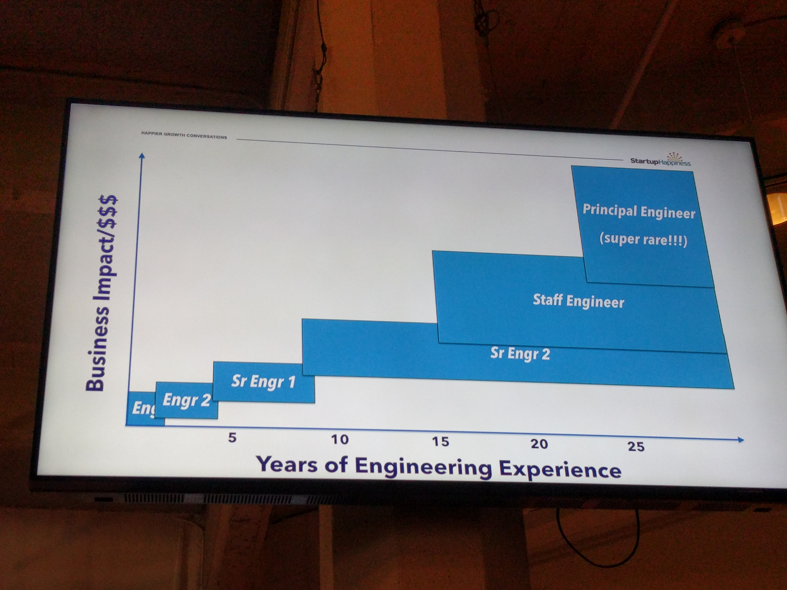

# Notes from Calibrate SF 2017

This is a collection of notes from the Calibrate SF 2017 conference: https://www.calibratesf.com

---

### New Manager Death Spiral
#### Michael Lopp - VP of Engineering @ Slack

**1. I can do it, I'm the boss**

* you sign up for all the things
* you're now signing yourself up as well as your entire team
* failure mode: the quality of work has decreased
* your job is no longer to get things done, it's to get things done at scale

**2. I can do it all myself. I'm in control because I'm the boss**

* you no longer delegate
* you are no longer building trust or delegating tasks to others
* your job as a manager is to aggressively delegate
* your opinions about the task at hand or other people can easily become facts (this is how politics in the workplace get created)

**3. This is not me**

* **remember** - management is not a promotion. It is only a lateral move.
* IC track + Management track are completely separate and independent
* _management is a career restart_
* the problem is that a lot of silicon valley ICs have just jumped into management

**Final notes**

* the death spiral is not real
* let others change your mind
* "augment your obvious and non-obvious weaknesses with a diverse team"
* ideas do not become great with agreement
* good ideas from disagreements and discourse
* delegate more than is comfortable
* management itself already has alot of angst to the title since you are already dealing with an employee's compensation and promotion - show you deserve those responsibilities by building trust, overcommunicating, giving and receiving feedback
* being a manager means you're scrutinized in every way - think about whether you are building or corroding trust with every action
* be sure you have great people managers because people are your most valuable resources

---

### Climbing the Mountain of Leadership Productivity
#### Jared Jordan - Senior management growth engineering @ Evernote)

* always survey the landscape when you become a new manager
* "the key is always be open to feedback. this is a gift"
* **after a 1:1, as your report - how would you rank this 1:1?** - allows you to get feedback and spark discussion
* things to talk about with your report:
  * what do you like or don't like about the team
  * what does success look like to you?
* make an event loop for yourself
* suggested event loop:



---

### Navigating Difficult Conversations
#### Shivani Sharma - Senior Engineering Manager @ Slack

* it is all about emotional intelligence and building trust
* figure out the way people enjoy receiving feedback and recognition - **pro-tip** check out larahogan.me/blog/first-one-on-one-questions
* a google study showed that psychological safety is the biggest factor in building a successful team
* lead by example - how you behave under pressure
* "equanimity" - mental calmness and composure in difficult situations
* talk less and listen more
* breathing - releases cortisol in the system

**difficult conversations**

1. prepare - stating what happened and what was the effect
2. practice - role-play the difficult conversation with a peer and silent observer
3. deliver - **avoid the sandwich feedback (good, bad, good)**. The sandwich feedback comes off as ingenuine
4. problem solve together on what the next steps are 
5. retro on what went well and what could be improved

* when giving feedback, think of what your end goal is
* if someone is talking in circles, let them know that ultimately, you want to help them and perhaps taking a break and revisiting the conversation is needed

**resources**

* first 1:1 questions - larahogan.me/blog/first-one-on-one-questions
* "difficult conversations" book - https://www.amazon.ca/Difficult-Conversations-Discuss-What-Matters/dp/0143118447

---

### The Inclusive Leader: Developing Diverse Teams
#### Jill Wetzler - Director of Engineering @ Lyft

* **We must immediately grant trust to those we lead. We should assume we have ve not earned their trust as leaders**
* earn their trust: it provides safety, easier for feedback, and advocacy

**diversity**

* studies show that 77% of black women report having to prove themselves over and over again
* always be culture aware - be aware of gender pronouns, religious patterns, stereotypes
* **tech leaver statistics** - http://www.kaporcenter.org/tech-leavers/
* jill would attend under-represented groups at work just to as a silent observer just try to understand how others feel
* volunteer under-indexed groups for new roles or projects
* proactively share their interests with influential people
* publicly endorse proteges for the things they are good at
* hold senior team accountable for sponsoring others

**giving feedback**

* **giving feedback when it sucks is your job**
* **as managers of humans, we have to overcome our fear of human emotions**
* when giving feedback, state the following:
  * observation - factual, indisputable
  * impact - outcome as related to expectations
  * expectation - fair for their level
  * assistance - take an active role for their development
  * check yourself for bias

---

### Engineering Management anti-patterns
#### Rod Begbie - Engineering Managment @ Dropbox)

**different kinds of managers:**

* the cloner - you can't expect everyone to learn the same way you do
* the decider - you can't decide things on people's behalf
* the buddy - reports need to trust their managers to give them their feedback
* the a**hole
* the joker - people will believe everything you say
* the wolf-cryer

* be aware of the power dynamics if you are the joker

---

### Daydream Believers
#### Michael Ruggiero - Senior Engineering Manager @ Twilio

* you are a secondary school guidance counsellor
* 1:1 - what do you want to do in 5 years, 10 years...
* before you do a pip:
  * is it measurable?
  * is it too hard?
  * is it too easy?
  * people need feedback more than advice
  * before giving a pip, give them a 'side' project to let them have a chance to prove themselves
  * tell them you want to be able to delegate a project for them
  * project can't be trivial but can't be critical either
  * this might not be the right job for them but give them a project to have a chance to succeed

---

* gap between p2 and p3
  * clear verbal & written communication
  * intuiting the perspectives and emotions of others
  * prioritization and time management
* people normally expect career growth to be equal "steps":

**expectation**

```
i.e.
						         _ _
						        |
						     _ _|
						    |
						 _ _|
					   |
			^		_ _|
business  |
impact		|
			|
			|-------------> years of engineering experience
```

**reality**


---

**Resources**

book: management handbook
book: difficult conversations
book: gum.co/present-ebook/calibrate2017

slides: "the art of pre-meeting" - https://www.slideshare.net/KarenCatlin/the-premeeting-a-secret-weapon-for-new-managers/1

blog: larahogan.me/blog/
